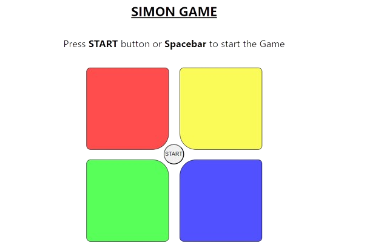

# Pattern Pulse

**Pattern Pulse** is an engaging memory game where players are challenged to replicate increasingly complex sequences of lights and sounds, testing their ability to recall patterns and stay in sync.

## Features

- **Interactive Gameplay:** Replicate sequences of lights and sounds in a captivating interface.
- **Progressive Difficulty:** The sequences grow longer and more challenging as you advance.
- **User Feedback:** Enjoy responsive visual and audio cues that enhance the gaming experience.

## Play the Game

Experience the full gameplay of Pattern Pulse here: [play Pattern Pulse](https://luckygoswami.github.io/Pattern-Pulse/)

### How to Play

1. Observe the sequence of lights and sounds.
2. Repeat the sequence by clicking the corresponding buttons in the same order.
3. Each level increases the length of the sequence. Stay sharp and keep up with the pattern!

## Screenshots



## Technologies Used

- **Frontend:** HTML, CSS, JavaScript
- **Audio:** Web Audio API for sound effects
- **UI/UX:** Responsive design for all screen sizes

## Run locally on your system

### Prerequisites

Make sure you have a modern web browser installed on your system.

### Installation

1. Clone the repository:

   ```bash
   git clone https://github.com/luckygoswami/pattern-pulse.git
   ```

2. Navigate to the project directory:

   ```bash
   cd pattern-pulse
   ```

3. Open the `index.html` file in your browser to start playing.

## Contributing

Contributions are welcome! Please fork this repository, make your changes, and submit a pull request.

1. Fork the repository
2. Create a new branch (`git checkout -b feature-branch`)
3. Commit your changes (`git commit -m 'Add new feature'`)
4. Push to the branch (`git push origin feature-branch`)
5. Open a pull request

## License

This project is licensed under the MIT License - see the [LICENSE](LICENSE) file for details.

## Contact

For any questions or feedback, feel free to reach out via [GitHub Issues](https://github.com/luckygoswami/pattern-pulse/issues).
